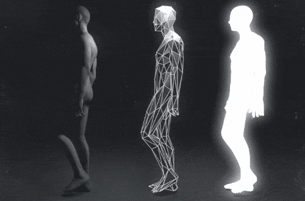

```
   _____ _______ _____  _____ _____  ______
  / ____|__   __|  __ \|_   _|  __ \|  ____|
 | (___    | |  | |__) | | | | |  | | |__
  \___ \   | |  |  _  /  | | | |  | |  __|
  ____) |  | |  | | \ \ _| |_| |__| | |____
 |_____/   |_|  |_|  \_\_____|_____/|______|

    Evolving 2D Walkers Using Genetic Algorithms
```

<br>

<p align="center">
  
</p>

<p align="center">
  <b>Teach a stick figure to walk using nothing but evolution.</b>
</p>

<p align="center">
  <a href="#quick-start">Quick Start</a> &bull;
  <a href="#how-it-works">How It Works</a> &bull;
  <a href="#web-dashboard">Web Dashboard</a> &bull;
  <a href="#experiments">Experiments</a> &bull;
  <a href="#project-structure">Project Structure</a>
</p>

---

## What is this?

STRIDE is a project that evolves a 2D bipedal creature to walk using Genetic Algorithms. A stick figure with 6 motorized joints (hips, knees, shoulders) and 2 spring elbows is dropped into a physics simulation, and a GA figures out the right combination of joint movements to make it walk forward.

Each joint is controlled by a simple sine wave with 3 parameters (amplitude, frequency, phase), giving us 18 genes per creature. The GA breeds, mutates, and selects the best walkers over 75 generations until something that actually walks emerges.

The project also comes with a full React + Three.js web dashboard where you can watch creatures walk, tweak their genes, compare algorithms, and explore the results interactively.

---

## The Creature

```
              Anatomy of a STRIDE Walker
   ┌──────────────────────────────────────────────┐
   │                                              │
   │            O  <-- head (cosmetic)            │
   │           /|\                                │
   │     ┌────┤ ├────┐                            │
   │     │  L │T│ R  │  T = Torso (60 x 20 px)   │
   │     │arm │o│arm │  Each arm: shoulder + elbow │
   │     └──┐ │r│ ┌──┘                            │
   │        │ │s│ │    Shoulders: motorized        │
   │        │ │o│ │    Elbows: spring (passive)    │
   │        ╧ └─┘ ╧                               │
   │          / \                                  │
   │    ┌────┘   └────┐                           │
   │    │ L leg  R leg│  Hips: motorized           │
   │    │    │   │    │  Knees: motorized           │
   │    └──┐ │   │ ┌──┘                            │
   │       │ │   │ │                               │
   │      [___] [___]   Feet: 20 x 5 px            │
   │                                              │
   └──────────────────────────────────────────────┘

   6 Motorized Joints = 18 Genes (3 per joint)
   ┌─────────────┬───────────┬───────────┐
   │  Amplitude  │ Frequency │   Phase   │
   │  [0, 1]     │ [0.5, 4]  │ [0, 2pi]  │
   └─────────────┴───────────┴───────────┘
```

Each gene controls one parameter of a sine wave: `torque = amplitude * sin(frequency * t + phase)`. The GA's job is to find the 18 numbers that produce coordinated walking.

---

## How It Works

```
   ┌─────────────────────────────────────────────────────────┐
   │                    GENETIC ALGORITHM                     │
   │                                                         │
   │   ┌──────────┐    ┌──────────┐    ┌──────────┐         │
   │   │ INIT 100 │───>│ EVALUATE │───>│  SELECT  │         │
   │   │ random   │    │ fitness  │    │ tourney  │         │
   │   │ creatures│    │ (15s sim)│    │ (size 3) │         │
   │   └──────────┘    └──────────┘    └────┬─────┘         │
   │                                        │               │
   │                                        v               │
   │   ┌──────────┐    ┌──────────┐    ┌──────────┐         │
   │   │  REPEAT  │<───│  MUTATE  │<───│CROSSOVER │         │
   │   │  x 75    │    │  (5%)    │    │  (80%)   │         │
   │   │  gens    │    │ gaussian │    │ 1-point  │         │
   │   └──────────┘    └──────────┘    └──────────┘         │
   │                                                         │
   │   Elitism: top 5% pass through unchanged                │
   └─────────────────────────────────────────────────────────┘

                          │
                          v

   ┌─────────────────────────────────────────────────────────┐
   │                   FITNESS FUNCTION                       │
   │                                                         │
   │   fitness = distance_walked                              │
   │            + smoothness_bonus                            │
   │            - falling_penalty                             │
   │            - energy_penalty                              │
   │                                                         │
   │   Simulated for 15 seconds at 60 FPS using pymunk       │
   └─────────────────────────────────────────────────────────┘
```

---

## Quick Start

### Prerequisites

- Python 3.10+
- Node.js 18+ (for the web dashboard)

### Python Setup

```bash
# Clone the repo
git clone https://github.com/Dxv-404/stride.git
cd stride

# Create a virtual environment
python -m venv venv
source venv/bin/activate   # Linux/Mac
venv\Scripts\activate      # Windows

# Install dependencies
pip install -r requirements.txt
```

### Run a Quick Validation

```bash
# Sanity check that everything works
python main.py --validate
```

### Run Experiments

```bash
# Run the baseline experiment (single run, fast)
python main.py --priority p0

# Run all experiments (this takes a while)
python main.py --priority all

# Or go sequential if multiprocessing causes issues
python main.py --priority all --sequential

# Full pipeline: validate -> run -> analyze -> generate report
python main.py --full-pipeline
```

### Web Dashboard

```bash
cd web
npm install
npm run dev
```

Then open `http://localhost:5173` in your browser.

---

## Web Dashboard

The web app is a multi-page React application with a scrollytelling landing page and several interactive tools.

### Pages

```
  ┌──────────────────────────────────────────────┐
  │              STRIDE WEB DASHBOARD             │
  ├──────────────────────────────────────────────┤
  │                                              │
  │  /            Landing page                   │
  │               Scrollytelling intro with      │
  │               wireframe human, chart          │
  │               carousel, and cube explosion    │
  │                                              │
  │  /lab         Experiment Lab                 │
  │               Run the GA live, watch          │
  │               creatures evolve in real time   │
  │                                              │
  │  /playground  Gene Playground                │
  │               Tweak individual genes and      │
  │               see how the walker changes      │
  │                                              │
  │  /compare     Walker Comparison              │
  │               Side-by-side creature races     │
  │                                              │
  │  /results     Results Dashboard              │
  │               Charts, stats, and analysis     │
  │               from all experiment runs        │
  │                                              │
  │  /push-test   Push Testing                   │
  │               Test walker robustness by       │
  │               applying force perturbations    │
  │                                              │
  │  /terrain     Terrain Editor                 │
  │               Build custom terrain profiles   │
  │               with hills, slopes, friction    │
  │                                              │
  │  /learn       Learn                          │
  │               Educational content about       │
  │               genetic algorithms              │
  │                                              │
  │  /hall-of-fame  Hall of Fame                 │
  │               Best walkers from all runs      │
  │                                              │
  └──────────────────────────────────────────────┘
```

### Landing Page

The landing page uses a scroll-driven animation system built on GSAP ScrollTrigger + Lenis smooth scroll:

1. **Intro** - "STRIDE" cycles through 8 Indian regional scripts with a synced 00-to-100 counter
2. **Creation of Adam** - Robot hand and human hand slide in from opposite sides
3. **Wireframe Human** - Interactive 3D model with clickable joint markers (scroll-locked section)
4. **About** - Split layout with the human model sliding left
5. **Showcase** - Chart carousel inside a retro TV frame
6. **Cube Explosion** - Wireframe cube shatters into pieces, revealing the "Enter the Lab" button
7. **Footer** - STRIDE title with the walking creature GIF

### Tech Stack

```
  Frontend
  ├── React 19 + TypeScript
  ├── Three.js / React Three Fiber  (3D graphics)
  ├── Pixi.js + p2 physics          (2D simulation)
  ├── GSAP + ScrollTrigger           (scroll animations)
  ├── Lenis                          (smooth scroll)
  ├── Recharts                       (data visualization)
  ├── Zustand                        (state management)
  ├── Framer Motion                  (UI transitions)
  ├── TailwindCSS                    (styling)
  └── Vite                           (build tool)
```

---

## Experiments

STRIDE runs 17 experiment configurations, each repeated 30 times with different seeds (42-71) for statistical robustness.

### Experiment Matrix

```
  ┌──────────────────────┬───────────────────────────────┐
  │ Category             │ Configurations                │
  ├──────────────────────┼───────────────────────────────┤
  │ Baselines            │ Standard GA, Random Search    │
  │ Encoding             │ Direct vs Indirect (9 genes)  │
  │ Selection            │ Tournament, Roulette, Rank    │
  │ Mutation Rate        │ 1%, 5%, 15%, 30%              │
  │ Crossover            │ 1-point, 2-point, Uniform     │
  │ Population Size      │ 50, 100, 200                  │
  │ Terrain              │ Flat, Hill, Mixed             │
  │ Advanced             │ Island Model, Fitness Sharing │
  ├──────────────────────┼───────────────────────────────┤
  │ V2: Controllers      │ CPG, CPG+NN, Cascade Seeding │
  │ V2: Ablation         │ Frozen NN, 2x Budget         │
  └──────────────────────┴───────────────────────────────┘

  Also compared against:
  - Differential Evolution (DE)
  - Particle Swarm Optimization (PSO)
  - CMA-ES
```

### Running Specific Experiments

```bash
# Priority groups
python main.py --priority p0    # Core baselines (fast)
python main.py --priority p1    # Main comparisons
python main.py --priority p2    # Extended analysis

# Specific experiments by name
python main.py --experiments baseline ga_vs_random encoding_comparison

# V2 experiments (CPG/CPG+NN controllers)
python main.py --v2 --priority all

# Print summary table of results
python main.py --summary
```

---

## Project Structure

```
stride/
│
├── main.py                     # CLI entry point
├── requirements.txt            # Python dependencies
├── .gitignore
│
├── src/                        # Python GA engine
│   ├── config.py               #   All experiment configurations
│   ├── creature.py             #   2D creature body definition
│   ├── physics_sim.py          #   Pymunk physics wrapper
│   ├── ga_core.py              #   Genetic algorithm engine
│   ├── encoding.py             #   Direct & indirect encoding
│   ├── fitness.py              #   Fitness evaluation
│   ├── sensors.py              #   Creature sensor data
│   ├── terrain.py              #   Terrain generation
│   ├── cpg_controller.py       #   Central Pattern Generator (V2)
│   ├── cpgnn_controller.py     #   CPG + Neural Network (V2)
│   ├── baselines.py            #   DE, PSO, CMA-ES
│   ├── random_search.py        #   Random search baseline
│   └── utils.py                #   Helpers
│
├── experiments/                # Experiment runners & analysis
│   ├── run_experiments.py      #   V1 experiment runner
│   ├── run_v2_experiments.py   #   V2 experiment runner
│   ├── analyze_results.py      #   Statistical analysis
│   ├── export_for_web.py       #   Export results as JSON for web
│   ├── gait_analysis.py        #   Walking pattern analysis
│   ├── landscape_analysis.py   #   Fitness landscape analysis
│   └── results/                #   Output CSVs and JSON exports
│       └── web_export/         #   JSON data served by web app
│
├── visualization/              # Matplotlib figure generators
│   ├── convergence_plot.py
│   ├── heatmap.py
│   ├── creature_diagram.py
│   ├── encoding_diagram.py
│   └── ... (25+ visualization scripts)
│
├── figures/                    # Generated PNG figures
│
├── report/                     # PDF report generation
│   ├── cia3_report.tex         #   LaTeX source
│   ├── generate_report.py      #   ReportLab PDF builder
│   └── stride_report.pdf       #   Final report
│
├── assets/                     # Raw source assets
│   ├── connect/                #   Hand images (Creation of Adam)
│   └── man/                    #   Wireframe human GLB model
│
└── web/                        # React web dashboard
    ├── package.json
    ├── vite.config.ts
    ├── index.html
    │
    ├── public/                 # Static assets
    │   ├── models/             #   3D models (GLB)
    │   ├── data/               #   Experiment JSON data
    │   ├── connect/            #   Hand images
    │   └── fonts/              #   Typefaces
    │
    └── src/
        ├── main.tsx            #   App entry point
        ├── App.tsx             #   Router setup
        ├── index.css           #   Global styles + Lenis
        │
        ├── pages/              #   Route pages
        │   ├── Landing.tsx     #     Scrollytelling homepage
        │   ├── Lab.tsx         #     GA experiment workspace
        │   ├── Playground.tsx  #     Gene tweaking sandbox
        │   ├── Compare.tsx     #     Walker comparison races
        │   ├── Results.tsx     #     Data dashboard
        │   └── ...
        │
        ├── components/
        │   ├── landing/        #   Landing page sections
        │   │   ├── ConnectSection.tsx    # Creation of Adam intro
        │   │   ├── WireframeHuman.tsx    # 3D human model
        │   │   ├── ScrollCanvas.tsx      # Fixed R3F canvas
        │   │   ├── ScrollOverlay.tsx     # HTML scroll container
        │   │   ├── CubeExplosion.tsx     # Wireframe cube
        │   │   └── ...
        │   │
        │   ├── simulation/     #   2D physics simulation
        │   │   ├── LiveCanvas.tsx        # Pixi.js renderer
        │   │   ├── CreatureRenderer.ts   # Creature drawing
        │   │   └── ...
        │   │
        │   ├── viz/            #   Data visualizations
        │   │   ├── FitnessLandscape3D.tsx
        │   │   ├── PopulationSwarm.tsx
        │   │   ├── BehavioralRadar.tsx
        │   │   └── ...
        │   │
        │   └── shared/         #   Reusable UI components
        │
        ├── engine/             #   Browser-side GA engine
        │   ├── physics.ts      #     p2.js physics
        │   ├── creature.ts     #     Creature definition
        │   ├── ga.ts           #     GA logic
        │   └── worker.ts       #     Web Worker bridge
        │
        ├── stores/             #   Zustand state stores
        ├── hooks/              #   Custom React hooks
        └── lib/                #   Utility libraries
```

---

## Key Configuration

The default GA parameters (from `src/config.py`):

```python
BASELINE = {
    "pop_size": 100,
    "generations": 75,
    "crossover_rate": 0.8,
    "mutation_rate": 0.05,
    "selection": "tournament",
    "tournament_size": 3,
    "elitism_pct": 0.05,
    "crossover_type": "single_point",
    "encoding": "direct",
}
```

Physics constants:

```python
GRAVITY = (0, -981)        # px/s^2
SIM_TIME = 15              # seconds per evaluation
FPS = 60                   # physics steps per second
TORSO_SIZE = (60, 20)      # pixels
SPRING_STIFFNESS = 5000    # elbow spring
SPRING_DAMPING = 70        # elbow damping
```

---

## How Fitness is Calculated

The fitness function rewards forward movement while penalizing energy waste and instability:

```
  fitness = distance_walked
          + smoothness_bonus
          - falling_penalty
          - energy_penalty

  where:
    distance_walked   = horizontal displacement of torso center
    smoothness_bonus   = reward for consistent velocity
    falling_penalty    = large penalty if torso touches ground
    energy_penalty     = sum of |torque| across all joints
```

Each creature is simulated for 15 seconds. If it falls over, the simulation ends early and applies the falling penalty.

---

## Results at a Glance

After 75 generations with a population of 100:

```
  ┌────────────────────────────────────────────────┐
  │         Fitness Convergence (typical run)       │
  │                                                │
  │  800 ┤                          ╭──────────    │
  │      │                     ╭────╯              │
  │  600 ┤                ╭────╯                   │
  │      │           ╭────╯                        │
  │  400 ┤      ╭────╯                             │
  │      │  ╭───╯                                  │
  │  200 ┤──╯                                      │
  │      │                                         │
  │    0 ┤─────┬─────┬─────┬─────┬─────┬─────     │
  │      0    12    25    37    50    62    75      │
  │                  Generation                    │
  └────────────────────────────────────────────────┘
```

The GA consistently outperforms random search, DE, PSO, and CMA-ES on this problem. Tournament selection with single-point crossover and 5% mutation rate gives the best results. Check out the `/results` page on the web dashboard for detailed comparisons.

---

## Report

The full project report is available at `report/stride_report.pdf`. It covers:

- Background on genetic algorithms and bipedal locomotion
- Creature design and physics simulation details
- All 17 experiment configurations and their results
- Statistical analysis (30 runs per config, Mann-Whitney U tests)
- Comparison with DE, PSO, and CMA-ES
- V2 experiments with CPG and CPG+NN controllers
- Discussion of gait analysis and behavioral fingerprints

---

## Built With

| Layer | Tools |
|-------|-------|
| Physics Simulation | pymunk, p2.js |
| Genetic Algorithm | Custom Python engine |
| 3D Graphics | Three.js, React Three Fiber |
| 2D Rendering | Pixi.js |
| Scroll Animations | GSAP ScrollTrigger, Lenis |
| Charts | Recharts |
| Frontend | React 19, TypeScript, TailwindCSS |
| Build | Vite |
| Report | ReportLab, LaTeX |

---

## License

This is a university project built for the Optimisation Techniques course at CHRIST University, Pune.

---

<p align="center">
  <sub>Dev Krishna &middot; 2026</sub>
</p>
